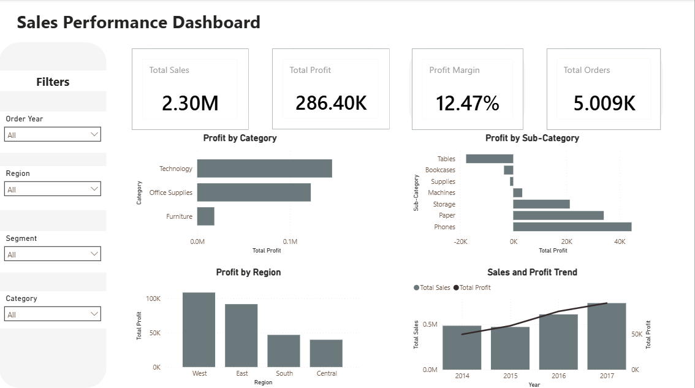

# 📊 Sales Performance Dashboard

## 📌 Project Overview

This project analyzes a retail sales dataset to evaluate business performance, identify profitability issues, and build an interactive Power BI dashboard for decision-making.

The project follows a complete data analysis workflow including data cleaning, exploratory data analysis (EDA), business insight generation, and dashboard development.

---

## 🎯 Business Problem

The company wants to understand:

- Which product categories generate the highest profit?
- Which products are causing losses?
- Which regions perform poorly?
- How sales and profit change over time?

---

## 🛠 Tools Used

- Python
- Pandas
- Power BI
- DAX

---

## 📂 Project Workflow

1. Data Cleaning
2. Exploratory Data Analysis
3. Business Insight Generation
4. Dashboard Development

---

## 📈 Dashboard Preview



---

## 💡 Key Insights

- Technology achieved the highest profit margin.
- Furniture generated high sales but very low profitability.
- Tables and Bookcases were the primary loss-making sub-categories.
- Central region showed the weakest profitability.
- Additional shipping cost data is required to identify the exact cause of losses.

---

## 📊 Dashboard Features

- KPI Cards
- Profit by Category
- Profit by Sub-Category
- Profit by Region
- Sales & Profit Trend
- Interactive Filters

---

## 🚀 Repository Structure

```
Sales-Performance-Dashboard/
│
├── Sales_Performance_Dashboard.pbix
├── SampleSuperstore.csv
├── Dashboard.png
└── README.md
```

---

## 👤 Author

Mohamed Ayman
